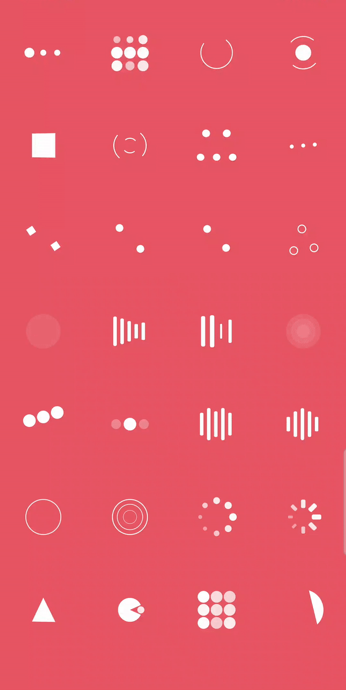

* * *

LoadingIndicatorView
===================

> **Now LoadingIndicatorView was updated version to 1.X , If you have any question or suggestion  with this library , welcome to tell me !**

## Introduction
LoadingIndicatorView is a collection of nice loading animations for Android.

## Demo


## Usage

### Step 1

Add dependencies in build.gradle.
```groovy
    dependencies {
       implement 'com.github.jainam69:LoadingIndicator:1.0.0'
    }
```

### Step 2

Add the LoadingIndicatorView to your layout:

Simple 

```java
    <com.loadingindicator.LoadingIndicatorView
        android:layout_width="wrap_content"  
        android:layout_height="wrap_content"
        app:indicatorName="BallPulseIndicator"
        />
```

Advance

```java
    <com.loadingindicator.LoadingIndicatorView
        android:id="@+id/avi"
        android:layout_width="wrap_content"  //or your custom size
        android:layout_height="wrap_content"  //or your custom size
        style="@style/LoadingIndicatorView"// or LoadingIndicatorView.Large or LoadingIndicatorView.Small
        android:visibility="visible"  //visible or gone
        app:indicatorName="BallPulseIndicator"//Indicator Name
        app:indicatorColor="your color"
        />
```

### Step 3

It's very simple use just like .
```java
   void startAnim(){
        avi.show();
        // or avi.smoothToShow();
   }
   
   void stopAnim(){
        avi.hide();
        // or avi.smoothToHide();
   }
   
```

## Custom Indicator

See [MyCustomIndicator](https://github.com/jainam69/LoadingIndicator/blob/master/app/src/main/java/com/sample/loadingindicator/MyCustomIndicator.kt) in Sample .

## Proguard

When using proguard need add rules:

```
-keep class com.loadingindicator.** { *; }
-keep class com.loadingindicator.indicators.** { *; }
```

Indicators is load from class names, proguard may change it (rename).

## Indicators

As seen above in the **Demo**, the indicators are as follows:

**Row 1**
 * `BallPulseIndicator`
 * `BallGridPulseIndicator`
 * `BallClipRotateIndicator`
 * `BallClipRotatePulseIndicator`

**Row 2**
 * `SquareSpinIndicator`
 * `BallClipRotateMultipleIndicator`
 * `BallPulseRiseIndicator`
 * `BallRotateIndicator`

**Row 3**
 * `CubeTransitionIndicator`
 * `BallZigZagIndicator`
 * `BallZigZagDeflectIndicator`
 * `BallTrianglePathIndicator`

**Row 4**
 * `BallScaleIndicator`
 * `LineScaleIndicator`
 * `LineScalePartyIndicator`
 * `BallScaleMultipleIndicator`

**Row 5**
 * `BallPulseSyncIndicator`
 * `BallBeatIndicator`
 * `LineScalePulseOutIndicator`
 * `LineScalePulseOutRapidIndicator`

**Row 6**
 * `BallScaleRippleIndicator`
 * `BallScaleRippleMultipleIndicator`
 * `BallSpinFadeLoaderIndicator`
 * `LineSpinFadeLoaderIndicator`

**Row 7**
 * `TriangleSkewSpinIndicator`
 * `PacmanIndicator`
 * `BallGridBeatIndicator`
 * `SemiCircleSpinIndicator`
 
**Row 8**
 * `com.sample.loadingindicator.MyCustomIndicator`

## Thanks
- [AVActivityIndicatorView](https://github.com/HarlonWang/AVLoadingIndicatorView)
- [NVActivityIndicatorView](https://github.com/ninjaprox/NVActivityIndicatorView)
- [Connor Atherton](https://github.com/ConnorAtherton)

### License
```
Copyright 2024 Jainam Doshi

Licensed under the Apache License, Version 2.0 (the "License");
you may not use this file except in compliance with the License.
You may obtain a copy of the License at

   http://www.apache.org/licenses/LICENSE-2.0

Unless required by applicable law or agreed to in writing, software
distributed under the License is distributed on an "AS IS" BASIS,
WITHOUT WARRANTIES OR CONDITIONS OF ANY KIND, either express or implied.
See the License for the specific language governing permissions and
limitations under the License.
```

